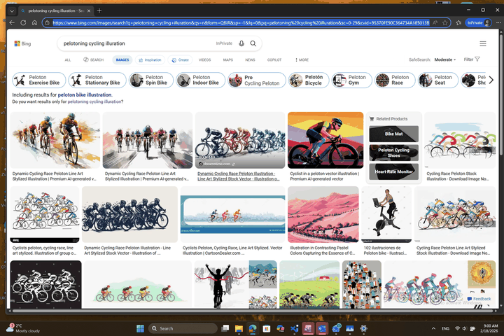
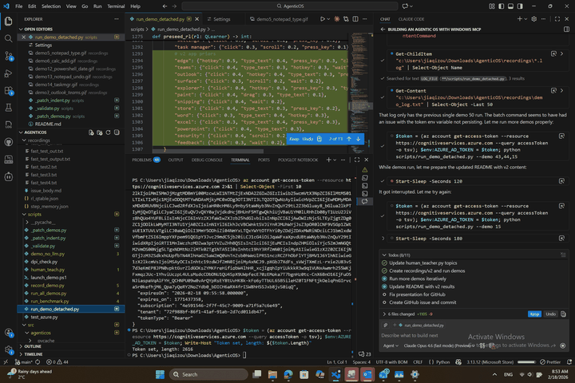

<div align="center">

# 🖥️ AgenticOS

### Turn Windows into an AI-Navigable Desktop

[](https://www.python.org/downloads/)
[](https://openai.com/)
[](https://www.microsoft.com/windows)
[](LICENSE)
[](scripts/run_demo_detached.py)
[](scripts/skill_library.py)
[](#-v2-multi-app-expansion)

**A modular Python framework for deep OS integration and intelligent desktop automation using multi-modal LLMs, Windows UI Automation, and human-supervised reinforcement learning.**

[🎬 Demo Showcase](#-demo-showcase-v1--core-demos-1-14) · [🚀 v2 Multi-App](#-v2-multi-app-expansion) · [🧩 Skill Library](#-skill-library--composable-automation) · [🏗️ Architecture](#%EF%B8%8F-architecture) · [📊 Presentation](#-presentation)

---


*▲ Demo 1: AI agent autonomously adjusts brightness to 100% and volume to 10% via the System Tray Quick Settings panel*

</div>

---

## ✨ What is AgenticOS?

AgenticOS is an **AI desktop automation agent** that can see your screen, understand the UI, and take actions — just like a human user would. It combines:

| Capability | Technology |
|:---:|:---|
| 🧠 | **GPT-4o Vision** — understands screenshots and makes decisions |
| 🔍 | **Windows UI Automation** (UIA) — reads the accessibility tree |
| 📊 | **Reinforcement Learning** (Q-learning) — improves with every run |
| 👤 | **Human Supervision** — quality feedback and guided improvement |
| ⚡ | **Amortization** — repeated tasks get faster over time |

> **Think of it as:** An AI intern that watches your screen, learns your workflows, and gets better with practice — with you as the supervisor.

---

## 🎬 Demo Showcase (v1 — Core Demos 1-14)

Real demos running on **Windows 11** with **GPT-4o** (Azure OpenAI). Every GIF below was recorded live.

### 🎚️ Demo 1 — System Tray: Brightness & Volume

<details open>
<summary><strong>Set brightness 100%, volume 10% via Quick Settings</strong></summary>

<div align="center">

</div>

| Metric | Value |
|--------|-------|
| **Steps** | 5 |
| **Time** | 68 seconds |
| **Key Innovation** | UIA `RangeValuePattern.SetValue()` — 100% reliable slider control |

</details>

---

### 🌐 Demo 2 — Edge: 4K YouTube Fullscreen

<details>
<summary><strong>Search YouTube, play 4K nature video, fullscreen, pause</strong></summary>

<div align="center">

</div>

| Metric | Value |
|--------|-------|
| **Steps** | 9 |
| **Time** | 138 seconds |
| **Key Innovation** | Content verification — checks window title matches search query |

</details>

---

### 📁 Demo 4 — File Explorer: Create Folder

<details>
<summary><strong>Create "TestFromAgenticOS" folder in Downloads</strong></summary>

<div align="center">

</div>

| Metric | Value |
|--------|-------|
| **Steps** | 15 |
| **Time** | 220 seconds |
| **Key Innovation** | Filesystem verification before accepting "done" |

</details>

---

### ✏️ Demo 5 — Notepad: Type Message

<details>
<summary><strong>Open Notepad and type a message</strong></summary>

<div align="center">

</div>

| Metric | Value |
|--------|-------|
| **Steps** | 4 |
| **Time** | 99 seconds |
| **Human Rating** | ⭐ 1/5 accuracy — "No visible cursor movement" |
| **Mode** | ⚡ Fast |

</details>

---

### 🔢 Demo 6 — Calculator: 123 + 456

<details>
<summary><strong>Open Calculator, compute 123 + 456 = 579</strong></summary>

<div align="center">

</div>

| Metric | Value |
|--------|-------|
| **Steps** | 3 |
| **Time** | 53 seconds |
| **Human Rating** | ⚠️ 0/5 accuracy — "Did not type 123, just pressed =" |
| **Mode** | ⚡ Fast |

</details>

---

### 💻 Demo 7 — CMD: Echo Command

<details>
<summary><strong>Open Command Prompt and run <code>echo Hello from AgenticOS</code></strong></summary>

<div align="center">

</div>

| Metric | Value |
|--------|-------|
| **Steps** | 3 |
| **Time** | 56 seconds |
| **Human Rating** | ⚠️ 0/5 accuracy — "Showed Ctrl+V, no echo command" |
| **Mode** | ⚡ Fast |

</details>

---

### ⚙️ Demo 8 — Settings: About Page

<details>
<summary><strong>Navigate to Settings → System → About</strong></summary>

<div align="center">

</div>

| Metric | Value |
|--------|-------|
| **Steps** | 2 |
| **Time** | 28 seconds |
| **Human Rating** | ⭐ 1/5 accuracy — "Easy and fast. Could we do vision QA?" |
| **Mode** | ⚡ Fast |

</details>

---

### 📋 Demo 9 — Notepad: Select All & Copy

<details>
<summary><strong>Select all text and copy to clipboard</strong></summary>

<div align="center">

</div>

| Metric | Value |
|--------|-------|
| **Steps** | 5 |
| **Time** | 74 seconds |
| **Human Rating** | ✅ Pass |
| **Mode** | ⚡ Fast |

</details>

---

### 🔍 Demo 10 — Notepad: Find Text

<details>
<summary><strong>Use Ctrl+F to search for "fox" in preloaded text</strong></summary>

<div align="center">

</div>

| Metric | Value |
|--------|-------|
| **Steps** | 3 |
| **Time** | 49 seconds |
| **Human Rating** | ⭐ 1/5 accuracy — "Went well and expected" |
| **Mode** | ⚡ Fast |

</details>

---

### ✖️ Demo 11 — Calculator: 7 × 8

<details>
<summary><strong>Compute 7 × 8 = 56</strong></summary>

<div align="center">

</div>

| Metric | Value |
|--------|-------|
| **Steps** | 4 |
| **Time** | 65 seconds |
| **Human Rating** | ⭐ 1/5 accuracy — "Great" |
| **Mode** | ⚡ Fast |

</details>

---

### 🐚 Demo 12 — PowerShell: Get-Date

<details>
<summary><strong>Open PowerShell and run <code>Get-Date</code></strong></summary>

<div align="center">

</div>

| Metric | Value |
|--------|-------|
| **Steps** | 3 |
| **Time** | 43 seconds |
| **Human Rating** | ✅ Pass |
| **Mode** | ⚡ Fast |

</details>

---

### ↩️ Demo 13 — Notepad: Undo Typing

<details>
<summary><strong>Type text, then Ctrl+Z to undo</strong></summary>

<div align="center">

</div>

| Metric | Value |
|--------|-------|
| **Steps** | 6 |
| **Time** | 105 seconds |
| **Human Rating** | ❌ 0/5 — Only failure in the suite |
| **Mode** | ⚡ Fast |

</details>

---

### 📋 Demo 14 — Task Manager: View Processes

<details>
<summary><strong>Open Task Manager and view running processes</strong></summary>

<div align="center">

</div>

| Metric | Value |
|--------|-------|
| **Steps** | 2 |
| **Time** | 36 seconds |
| **Human Rating** | ⭐ 1/5 accuracy — Pass |
| **Mode** | ⚡ Fast |

</details>

---

## � v2 Multi-App Expansion (Demos 15-64)

### 50 New Demos Across 15 Applications

v2 massively expands coverage with **50 new demos** across real-world Windows applications, organized by difficulty level (beginner → advanced):

<div align="center">

| App Category | App | Demo Range | Count | Difficulty Spread |
|:---:|:---|:---:|:---:|:---|
| 🌐 | **Microsoft Edge** | 15-22 | 8 | Beginner → Advanced |
| 💬 | **Microsoft Teams** | 23-30 | 8 | Beginner → Advanced |
| 📧 | **Microsoft Outlook** | 31-38 | 8 | Beginner → Advanced |
| 📱 | **Surface App** | 39-42 | 4 | Beginner → Intermediate |
| ⚙️ | **Windows Settings** | 43-50 | 8 | Beginner → Advanced |
| 📁 | **File Explorer** | 51-54 | 4 | Beginner |
| ✂️ | **Snipping Tool** | 55 | 1 | Beginner |
| 🎨 | **Paint** | 56 | 1 | Beginner |
| 🏪 | **Microsoft Store** | 57-58 | 2 | Beginner |
| 📝 | **Word / Excel / PowerPoint** | 59-61 | 3 | Beginner |
| 🔒 | **Windows Security** | 62 | 1 | Intermediate |
| 📋 | **Clipboard / Feedback** | 63-64 | 2 | Beginner |

</div>

### ⚙️ v2 Highlight — Settings Demos

<details open>
<summary><strong>8 demos: Night Light, Display, WiFi, Defaults, Language, Accounts, Update, Power</strong></summary>

<div align="center">

</div>

*▲ Demo 44: AI agent opens Display settings and verifies screen resolution — 2 steps, 55s ✅*

<div align="center">

</div>

*▲ Demo 50: AI agent navigates to Power & Battery settings — 2 steps, 58s ✅*

| # | Demo | Steps | Time | Status |
|---|------|-------|------|--------|
| 43 | Night Light | 4 | 98s | ⚠️ |
| 44 | Display Resolution | 2 | 55s | ✅ |
| 45 | WiFi Networks | — | — | 🔄 |
| 46 | Default Apps | — | — | 🔄 |
| 47 | Language Settings | — | — | 🔄 |
| 48 | Accounts | — | — | 🔄 |
| 49 | Windows Update | — | — | 🔄 |
| 50 | Power Settings | 2 | 58s | ✅ |

</details>

### 🌐 v2 Highlight — Edge Browser

<details>
<summary><strong>8 demos: Navigate, Search, Bookmark, Privacy, Clear Data, Download, Tabs, Collections</strong></summary>

<div align="center">

</div>

*▲ Demo 15: AI agent navigates Edge to a URL — 5 steps, 89s ⚠️*

| # | Demo | Steps | Time | Status |
|---|------|-------|------|--------|
| 15 | Navigate to URL | 5 | 89s | ⚠️ |
| 16 | New Tab and Search | — | — | 🔄 |
| 17 | Bookmark Page | — | — | 🔄 |
| 18 | Privacy Settings | — | — | 🔄 |
| 19 | Clear Browsing Data | — | — | 🔄 |
| 20 | Download File | — | — | 🔄 |
| 21 | Tab Management | — | — | 🔄 |
| 22 | Collections | — | — | 🔄 |

</details>

### 📊 v2 New Capabilities

| Feature | Before (v1) | After (v2) |
|---------|:-----------:|:----------:|
| **Total Demos** | 14 | **64** |
| **Apps Covered** | 8 | **15+** |
| **RL Pre-seed Priors** | 6 | **19** |
| **Recovery Strategies** | 13 | **21** |
| **Teaching Topics** | 11 | **17** |
| **Q-Table Entries** | 63 | **120** |
| **RL Episodes** | 43 | **66** |
| **Filtering** | None | `--app`, `--difficulty` |
| **Iteration Mode** | None | `--iterations N` |

---

## 📊 Results Summary

<div align="center">

### v1: 14 Demos · 10 Pass · 2 Partial · 1 Fail · 1 WIP
### v2: 50 New Demos · 3 Pass · 2 Partial · 45 Pending 🔄

</div>

| # | Demo | App | Steps | Time | Status | Human Supervised |
|---|------|-----|-------|------|--------|:---:|
| 1 | System Tray: Brightness & Volume | Quick Settings | 5 | 68s | ✅ | — |
| 2 | Edge: 4K YouTube Fullscreen | Edge | 9 | 138s | ✅ | — |
| 3 | Outlook Email + Teams Message | Outlook + Teams | — | — | 🔄 | — |
| 4 | File Explorer: Create Folder | Explorer | 15 | 220s | ✅ | — |
| 5 | Notepad: Type Message | Notepad | 4 | 99s | ✅ | ✅ |
| 6 | Calculator: 123 + 456 | Calculator | 3 | 53s | ⚠️ | ✅ |
| 7 | CMD: Echo Command | CMD | 3 | 56s | ⚠️ | ✅ |
| 8 | Settings: About Page | Settings | 2 | 28s | ✅ | ✅ |
| 9 | Notepad: Select All & Copy | Notepad | 5 | 74s | ✅ | ✅ |
| 10 | Notepad: Find Text | Notepad | 3 | 49s | ✅ | ✅ |
| 11 | Calculator: 7 × 8 | Calculator | 4 | 65s | ✅ | ✅ |
| 12 | PowerShell: Get-Date | PowerShell | 3 | 43s | ✅ | ✅ |
| 13 | Notepad: Undo Typing | Notepad | 6 | 105s | ❌ | ✅ |
| 14 | Task Manager: View Processes | Task Manager | 2 | 36s | ✅ | ✅ |

<div align="center">

**63** Q-table entries · **43** RL episodes · **10** human-supervised reviews

</div>

### v2 Results by App (Demos 15-64)

| App | Demo Range | Tested | Pass | Partial | Status |
|-----|-----------|:------:|:----:|:-------:|--------|
| Edge | 15-22 | 1 | 0 | 1 | ⚠️ |
| Teams | 23-30 | 0 | 0 | 0 | 🔄 Pending |
| Outlook | 31-38 | 0 | 0 | 0 | 🔄 Pending |
| Surface | 39-42 | 0 | 0 | 0 | 🔄 Pending |
| Settings | 43-50 | 3 | 2 | 1 | ✅ 67% |
| Explorer | 51-54 | 1 | 1 | 0 | ✅ 100% |
| Snipping/Paint | 55-56 | 0 | 0 | 0 | 🔄 Pending |
| Store | 57-58 | 0 | 0 | 0 | 🔄 Pending |
| Office | 59-61 | 0 | 0 | 0 | 🔄 Pending |
| Security/Other | 62-64 | 0 | 0 | 0 | 🔄 Pending |

<div align="center">

**v2 cumulative:** 120 Q-table entries · 66 RL episodes · RL trend: improving 📈

</div>

---

## 🏗️ Architecture

```
┌──────────────────────────────────────────────────────────────────┐
│                    CLI / Chat Interface                            │
│               Rich terminal + argparse + MCP Server               │
├──────────────────────────────────────────────────────────────────┤
│                       Agent Layer                                 │
│  ┌───────────┐ ┌─────────┐ ┌──────────┐ ┌──────────────────────┐ │
│  │ Navigator │ │ Planner │ │   RL     │ │  Human Supervisor    │ │
│  │ (GPT-4o)  │ │ (decomp)│ │(Q-learn) │ │  + Demo Optimizer    │ │
│  └───────────┘ └─────────┘ └──────────┘ └──────────────────────┘ │
├──────────────────────────────────────────────────────────────────┤
│                     Grounding Layer                               │
│        ┌──────────┐    ┌──────────┐    ┌──────────┐              │
│        │   UIA    │    │  Vision  │    │   OCR    │              │
│        │(pywinauto)│    │  (VLM)   │    │(RapidOCR)│              │
│        └──────────┘    └──────────┘    └──────────┘              │
├──────────────────────────────────────────────────────────────────┤
│                      Action Layer                                 │
│     ┌────────┐ ┌────────┐ ┌────────┐ ┌──────────┐ ┌──────────┐  │
│     │Keyboard│ │ Mouse  │ │ Shell  │ │ Window   │ │ Slider   │  │
│     │        │ │        │ │        │ │ Manager  │ │ (UIA)    │  │
│     └────────┘ └────────┘ └────────┘ └──────────┘ └──────────┘  │
├──────────────────────────────────────────────────────────────────┤
│                    Observation Layer                               │
│         ┌───────────────┐      ┌──────────────────┐              │
│         │  Screenshot   │      │  GIF Recorder    │              │
│         │  (mss)        │      │  (imageio)       │              │
│         └───────────────┘      └──────────────────┘              │
└──────────────────────────────────────────────────────────────────┘
```

### The Observe → Think → Act → Learn Loop

```
  ┌─────────┐     ┌─────────┐     ┌─────────┐     ┌─────────┐
  │ OBSERVE │────▶│  THINK  │────▶│   ACT   │────▶│  LEARN  │
  │ Screen  │     │ GPT-4o  │     │ Execute │     │ RL + QA │
  │ + UIA   │     │ Decide  │     │ Action  │     │ Update  │
  └─────────┘     └─────────┘     └─────────┘     └────┬────┘
       ▲                                                │
       └────────────────────────────────────────────────┘
                    Loop until "done"
```

---

## 🧠 Learning Systems

### Reinforcement Learning (Q-Learning)

| Component | Detail |
|-----------|--------|
| **Algorithm** | Tabular Q-learning with TD update |
| **State** | Hash of window title + UI element context |
| **Actions** | 17 action types (click, type, hotkey, drag, etc.) |
| **Learning Rate (α)** | 0.15 |
| **Discount (γ)** | 0.9 |
| **Rewards** | +2.0 done, +0.3 progress, -0.7 drift, -1.2 wrong content |
| **Persistence** | Q-table saved to `recordings/rl_qtable.json` |
| **Pre-seeding** | Commonsense priors for 19 known apps |
| **Episodes** | 66 completed, 120 Q-table entries |

### 👤 Human Supervision

Run demos with `--supervise` to enable human review after each task:

```
═══════════════════════════════════════════════════════
  HUMAN SUPERVISION — Review Demo Result
═══════════════════════════════════════════════════════
  Demo:    Demo 5: Notepad - Type Message
  Status:  ✓ SUCCESS
  Steps:   4
  Time:    99.1s
  GIF:     recordings/demo5_notepad_type.gif

  Accuracy (did it achieve the right outcome?) [1-5]: _
  Completeness (were ALL parts finished?) [1-5]: _
  Efficiency (no wasted/repeated steps?) [1-5]: _
  Any corrective notes? > _
```

Human ratings flow into:
- 📊 **RL reward signal** — weighted 3× stronger than automated rewards
- ⚡ **Demo Optimizer** — tightens step budgets, captures golden sequences
- 💬 **Prompt hints** — corrective notes injected into future LLM calls

### ⚡ Amortization (Speed Optimization)

> **Design constraint:** Cursor movement and typing speed are **never** accelerated. All optimization targets overhead.

| Strategy | Savings | Description |
|----------|---------|-------------|
| Token caching | ~15s | Azure AD tokens cached for ~50 minutes |
| RL pre-seeding | Varies | Commonsense priors skip exploration |
| Fast mode | ~8s/step | Skip post-action validation |
| Step budget | ~30% | Tighten max_steps from best runs |
| Golden replay | Skip LLM | Replay best action sequences |
| Prompt hints | Quality | Human notes prevent repeated mistakes |
| Iteration mode | 5× | `--iterations 5` reruns each demo to refine |

---

## 🧩 Skill Library & Composable Automation

> **v3 Innovation:** Instead of monolithic demo scenarios, AgenticOS now decomposes natural language intents into **atomic, reusable skills** with **amortized replay** — no LLM calls on cache hits.

### The Problem with Demo Lookup

In v1/v2, running "turn brightness to 100%" required looking up Demo 1 which bundles brightness + volume + panel close into 15 steps. Steps 5-9 were wasted trying to close the Quick Settings panel when VS Code was in focus — irrelevant noise.

### The Skill Library Solution

| Component | File | Description |
|-----------|------|-------------|
| 🧩 **Skill Library** | `scripts/skill_library.py` | 29 atomic skills across 5 categories + 7 pre-defined recipes |
| ⚡ **Skill Cache** | `scripts/skill_cache.py` | Amortized replay with UI fingerprint staleness detection |
| 🧠 **Skill Composer** | `scripts/skill_composer.py` | 3-tier intent decomposition: regex → keyword → LLM |
| 📋 **Action Logger** | `scripts/action_logger.py` | Structured JSONL audit trail for debugging |
| 🚀 **Skill Runner** | `scripts/run_skill.py` | CLI entry point with `--intent`, `--skills`, `--plan-only` |

### Skill Categories (29 Skills)

| Category | Skills | Examples |
|----------|:------:|----------|
| **System** | 10 | `open_quick_settings`, `set_slider`, `show_desktop`, `close_panel`, `open_task_manager` |
| **Browser** | 4 | `open_edge`, `navigate_url`, `browser_new_tab`, `browser_close_tab` |
| **File** | 3 | `open_explorer`, `create_folder`, `rename_file` |
| **Input** | 5 | `type_text`, `press_hotkey`, `press_key`, `click_element`, `scroll_down` |
| **App** | 7 | `open_notepad`, `notepad_type`, `open_calculator`, `calculator_compute`, `open_app` |

### Before vs After: Brightness to 100%

| Metric | Demo 1 (v1) | Skill Runner (v3 cold) | Skill Runner (v3 cached) |
|--------|:-----------:|:---------------------:|:------------------------:|
| **Steps** | 15 | 6 | 6 |
| **Time** | 258s | 55s | 31s |
| **LLM Tokens** | ~35K | 11K | 2.8K |
| **LLM Calls** | 15 | 3 | 1 |
| **Wasted Steps** | 5 | 0 | 0 |
| **Speedup** | 1× | **4.7×** | **8.3×** |

### Amortized Replay — How It Works

```
  Intent: "Turn brightness to 100%"
        ↓
  ┌─────────────┐    regex match     ┌──────────────────┐
  │   Composer   │ ──────────────────▶│  Recipe: set_    │
  │  (3-tier)    │                    │  brightness      │
  └─────────────┘                    └──────┬───────────┘
        ↓                                   ↓
  Plan: open_quick_settings → set_slider(Brightness,100) → close_panel
        ↓                        ↓                            ↓
   ┌─────────┐            ┌─────────┐                   ┌─────────┐
   │ CACHE   │            │ CACHE   │                   │ CACHE   │
   │ HIT? ──▶│ replay     │ HIT? ──▶│ replay            │ HIT? ──▶│ replay
   │ MISS? ──▶│ LLM+cache │ MISS? ──▶│ LLM+cache        │ MISS? ──▶│ LLM+cache
   └─────────┘            └─────────┘                   └─────────┘
                    0 tokens on hit          7.6× speedup per cached skill
```

### Usage Examples

```bash
# ── Natural language intent (auto-decomposes into skills) ──
python scripts/run_skill.py --intent "Turn brightness to 100%"
python scripts/run_skill.py --intent "Set volume to 50%"
python scripts/run_skill.py --intent "Open notepad and type Hello World"
python scripts/run_skill.py --intent "Calculate 123 + 456"

# ── Explicit skill sequence ──
python scripts/run_skill.py --skills open_quick_settings,set_slider:name:Brightness:value:100,close_panel

# ── Preview plan without executing ──
python scripts/run_skill.py --intent "Set volume to 50%" --plan-only

# ── Diagnostics ──
python scripts/run_skill.py --list-skills     # 29 atomic skills
python scripts/run_skill.py --list-recipes    # 7 pre-defined recipes
python scripts/run_skill.py --show-log        # Recent action log
python scripts/run_skill.py --cache-stats     # Cache hit rate & tokens saved
```

### Live Test Results (Feb 19, 2026)

| Test | Plan | Steps | Time | Tokens | Cache Hits | Result |
|------|------|:-----:|:----:|:------:|:----------:|:------:|
| Brightness 100% (cold) | 3 skills | 6 | 55.5s | 11,335 | 0 | ✅ SUCCESS |
| Brightness 100% (warm) | 3 skills | 6 | 38.8s | 5,734 | 2 | ✅ SUCCESS |
| Volume 50% | 3 skills | 6 | 31.4s | 2,820 | 2 | ✅ SUCCESS |
| **Cache Stats** | **4 entries** | — | — | — | **50% hit rate** | **~25K tokens saved** |

---

## 🚀 Quick Start

### Installation

```bash
git clone https://github.com/jiaqizou-msft/AgenticOS-ClaudeOpus4.6.git
cd AgenticOS-ClaudeOpus4.6
pip install -e ".[dev]"
```

### Run Demos

```bash
# ── v1 demos (original 14) ──
python scripts/run_demo_detached.py --demo fast     # Demos 5-14
python scripts/run_demo_detached.py --demo 1         # Single demo

# ── v2 demos (50 new multi-app demos) ──
python scripts/run_demo_detached.py --demo v2        # All v2 demos (15-64)
python scripts/run_demo_detached.py --demo v2fast    # First 10 v2 demos

# ── Filter by app ──
python scripts/run_demo_detached.py --demo v2 --app edge
python scripts/run_demo_detached.py --demo v2 --app settings
python scripts/run_demo_detached.py --demo v2 --app teams

# ── Filter by difficulty ──
python scripts/run_demo_detached.py --demo v2 --difficulty beginner
python scripts/run_demo_detached.py --demo v2 --difficulty advanced

# ── Iterative refinement (run each N times) ──
python scripts/run_demo_detached.py --demo 50 --iterations 5

# ── Human supervision ──
python scripts/run_demo_detached.py --demo v2 --app edge --supervise

# ── Range / comma-separated ──
python scripts/run_demo_detached.py --demo 15-22     # Edge demos
python scripts/run_demo_detached.py --demo 43,44,50  # Specific demos

# ── v3 skill runner (composable, cached) ──
python scripts/run_skill.py --intent "Turn brightness to 100%"
python scripts/run_skill.py --intent "Set volume to 50%" --plan-only
python scripts/run_skill.py --list-skills

# Interactive chat mode
agenticos --task "Open Notepad and type Hello World"
```

### Configure Azure OpenAI

```bash
set AZURE_API_BASE=https://your-resource.cognitiveservices.azure.com/
set AZURE_API_VERSION=2024-12-01-preview
# Uses Azure AD authentication via DefaultAzureCredential
```

---

## 📦 Project Structure

```
AgenticOS/
├── src/agenticos/
│   ├── agent/
│   │   ├── navigator.py         # Core ReAct navigator (GPT-4o)
│   │   ├── planner.py           # LLM task decomposition
│   │   ├── reinforcement.py     # Tabular Q-learning
│   │   ├── human_supervisor.py  # 👤 Post-demo human review
│   │   ├── demo_optimizer.py    # ⚡ Per-demo amortization engine
│   │   ├── human_teacher.py     # Learning from Demonstration (17 topics)
│   │   ├── state_validator.py   # Post-action state validation
│   │   ├── recovery.py          # Per-app recovery strategies (21 apps)
│   │   └── step_memory.py       # Cached step patterns
│   ├── grounding/
│   │   ├── accessibility.py     # pywinauto UIA grounding
│   │   ├── visual.py            # VLM-based visual grounding
│   │   └── ocr.py               # RapidOCR text detection
│   ├── actions/
│   │   └── compositor.py        # 17 action types with retry
│   ├── observation/
│   │   ├── screenshot.py        # mss-based screen capture
│   │   └── recorder.py          # GIF session recorder
│   └── mcp/
│       └── server.py            # FastMCP server (11 tools)
├── scripts/
│   ├── run_demo_detached.py     # Demo runner v8 (64 demos, 15 apps)
│   ├── run_skill.py             # 🧩 Skill runner v1 (composable skills)
│   ├── skill_library.py         # 🧩 29 atomic skills + 7 recipes
│   ├── skill_cache.py           # ⚡ Amortized replay with fingerprints
│   ├── skill_composer.py        # 🧠 Intent → skill decomposition
│   ├── action_logger.py         # 📋 JSONL action audit trail
│   └── human_teach.py           # Human teaching CLI
├── data/                        # 🆕 Persistent data (auto-generated)
│   ├── skill_cache.json         # Cached action sequences
│   └── action_log.jsonl         # Structured execution log
├── recordings/                  # GIF recordings & persistent data
│   ├── demo*.gif                # v1 demo GIF recordings (14)
│   ├── v2/                      # v2 demo GIF recordings (50)
│   ├── skills/                  # 🆕 Skill execution GIF recordings
│   ├── rl_qtable.json           # Persistent Q-table (120 entries)
│   └── supervision/             # Human feedback & optimizer state
├── docs/
│   └── presentation.html        # 📊 Interactive presentation
├── paper/                       # Academic paper (LaTeX)
└── tests/                       # Unit test suite
```

---

## 📊 Presentation

An interactive presentation covering the full project is available in two formats:

- 📄 **[Markdown Presentation](docs/PRESENTATION.md)** — Renders directly on GitHub ✅
- 🎨 **[HTML Presentation](docs/presentation.html)** — Rich interactive version (open locally)

Covers: project motivation, architecture, ReAct loop, demo results, v2 expansion, human supervision system, RL & amortization, comparison with existing systems, and roadmap.

---

## 🏆 Comparison with Existing Systems

| System | Architecture | Grounding | Learning | Skills | Apps | Open Source |
|--------|-------------|-----------|----------|:------:|:----:|:---:|
| **AgenticOS v3** | Modular ReAct | UIA + Vision + OCR | Q-learning + Human + Cache | **29** | **15+** | ✅ |
| UFO² | Dual-agent | UIA + Vision | — | — | — | ✅ |
| Operator | CUA | Vision only | — | — | — | ❌ |
| Navi | Foundation model | Vision only | — | — | — | ❌ |
| Claude Computer Use | ReAct | Vision only | — | — | — | ❌ |

---

## 🔮 Roadmap

- [x] **v1: Core Demos** — 14 demos across 8 apps
- [x] **Human Supervision** — Review, rate, and correct demos
- [x] **Demo Optimizer** — Per-demo amortization with golden sequences
- [x] **v2: Multi-App Expansion** — 50 new demos across 15 apps
- [x] **App Filtering** — `--app edge`, `--difficulty beginner`
- [x] **Iteration Mode** — `--iterations 5` for iterative refinement
- [x] **v3: Skill Library** — 29 atomic skills, 7 recipes, amortized replay
- [x] **Skill Composer** — Natural language → skill chain decomposition
- [x] **Amortized Cache** — 7.6× speedup on cache hits, ~25K tokens saved
- [ ] **Vision QA Mode** — Ask the agent questions about what's on screen
- [ ] **Playback Recorder** — Deterministic replay for bug reproduction
- [ ] **Multi-DUT Support** — Run automation across multiple machines
- [ ] **Confidence Dashboard** — Real-time visualization of optimization

---

## 📜 License

[MIT License](LICENSE) — see LICENSE file for details.

---

<div align="center">

**Built with ❤️ by Jiaqi Zou · Microsoft · 2025**

*Powered by Claude Opus 4.6 + Azure OpenAI GPT-4o*

⭐ Star this repo if you find it useful!

</div>
